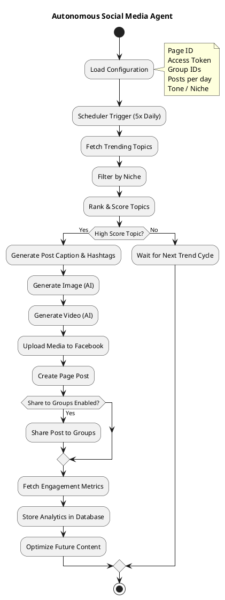
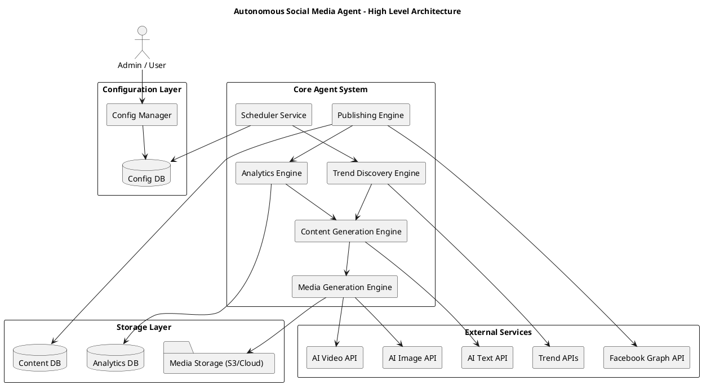

# 🤖 Autonomous Social Media Agent

An AI-powered automation system that discovers viral topics, generates content (text, image, video), publishes posts to Facebook, shares to groups, and optimizes engagement automatically.

---

# 📌 Overview

This project implements a fully autonomous **Social Media AI Agent** that:

* Detects trending topics
* Filters based on niche
* Generates AI-powered posts
* Publishes 5 times daily
* Shares to configured groups
* Tracks engagement
* Continuously optimizes content strategy

---

# 🗺 Flow Diagram (Activity Diagram)



---

# 🏗 High-Level Architecture Diagram

## 🔹 PlantUML Source



---

## 🖼 Architecture Diagram (Image Version)

If you generate the architecture diagram as an image (PNG/SVG), place it inside:

```
/docs/architecture.png
```

Then embed it in README like this:

```markdown
# 🏗 High-Level Architecture


```

---

## 📁 Suggested Project Structure

```
social-media-agent/
│
├── README.md
├── docs/
│   ├── architecture.png
│   └── flow-diagram.png
│
├── src/
│   ├── scheduler/
│   ├── trend_engine/
│   ├── content_engine/
│   ├── media_engine/
│   ├── publishing/
│   └── analytics/
│
├── config/
│   └── settings.json
│
└── docker-compose.yml
```

---

# 🔍 Architecture Explanation

## 1️⃣ Configuration Layer

Stores:

* Page ID
* Access tokens
* Group IDs
* Posting frequency
* Tone & niche

---

## 2️⃣ Core Agent System

| Component         | Responsibility                   |
| ----------------- | -------------------------------- |
| Scheduler         | Triggers automation cycles       |
| Trend Engine      | Finds viral topics               |
| Content Engine    | Generates captions & scripts     |
| Media Engine      | Creates AI image & video         |
| Publishing Engine | Posts to Facebook                |
| Analytics Engine  | Tracks and optimizes performance |

---

## 3️⃣ Storage Layer

* Content history
* Engagement metrics
* Media assets (S3/Cloud)

---

## 4️⃣ External Services

* Trend data APIs
* AI generation APIs
* Facebook Graph API

---

# 🚀 Production-Ready Features

* Configurable multi-page support
* Fully automated posting
* Engagement optimization loop
* Scalable microservice design
* Cloud-ready deployment

---

# 📈 Vision

To build a **self-learning AI marketing system** capable of autonomously growing and managing social media pages at scale.

---

If you'd like next, I can generate:

* ✅ Clean SVG architecture image
* ✅ GitHub-ready architecture PNG
* ✅ Investor-level architecture diagram
* ✅ Enterprise-grade cloud deployment diagram
* ✅ SaaS multi-tenant version

Tell me your goal (personal tool / SaaS / agency / startup) and I’ll tailor it to that level 🚀
